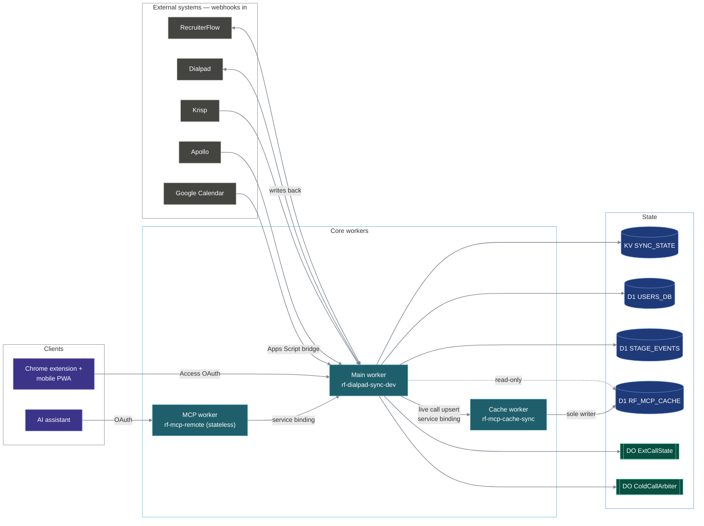

# recruit-edge-backend

[](https://github.com/HukijG/recruit-edge-backend/actions/workflows/ci.yml)

A serverless **distributed integration hub** that keeps a recruiting team's disconnected SaaS tools in lockstep — built as five cooperating Cloudflare Workers, a natural-language AI control surface, and an end-to-end observability pipeline.

> **Part of a three-repo system — the hub the other two depend on:**
> [recruit-extension](https://github.com/HukijG/recruit-extension) routes every API call, its
> OAuth identity, and its music bar through here;
> [recruit-tv-dashboard](https://github.com/HukijG/recruit-tv-dashboard) is remote-controlled
> by this repo's music worker and fed by its stats plane. The wiring:
> [How this connects](#how-this-repo-connects-to-the-rest-of-the-system) · [`docs/ECOSYSTEM.md`](./docs/ECOSYSTEM.md).

## What it is

A recruiter's day is spread across systems that don't talk to each other: [RecruiterFlow](https://recruiterflow.com) (the ATS / source of truth for candidates), [Dialpad](https://dialpad.com) (the phone system), Google Calendar (booked calls), [Krisp](https://krisp.ai) (the AI meeting note-taker), [Apollo](https://apollo.io) (contact enrichment), and a custom Chrome extension overlaying LinkedIn Recruiter. Each tool only knows about its own world.

This service stitches them into one: add a candidate in one place and they appear everywhere they're needed; call, booking, and meeting context flows back onto the candidate record automatically; and an AI assistant can search and drive the ATS in plain English — with no copy-pasting of names, numbers, and notes between systems, and **no UI to log into.** It runs entirely as edge Workers reacting to webhooks, plus a small authenticated API the Chrome extension / mobile PWA and the AI assistant call.

What makes it interesting as an engineering artefact is not the individual integrations — it's that they're built as a **real distributed system**: independently-deployed Workers with single-writer ownership of shared state, strongly-consistent coordination via Durable Objects where eventual consistency would bite, a thin-immutable read cache designed around a write-amplification failure, loop-prevention across bidirectional syncs, and full cross-worker distributed tracing.

### Scope & intent

This is **production internal tooling** — designed and built by a working recruiter, and in daily use by the whole recruiting team today with minimal issues. It is an internal system, not a commercial product. The LinkedIn Recruiter Chrome extension ([recruit-extension](https://github.com/HukijG/recruit-extension)) is a *pluggable candidate-source front-end*: it is one way to feed candidates into the sync API, and the data-acquisition side lives outside this repository. The integrations here read and write each provider's own API under the operating team's credentials; nothing in this public copy bypasses a provider's terms or ships scraping logic. The repository is published for portfolio review only — see [`NOTICE.md`](NOTICE.md).

## The stack

- **Runtime:** [Cloudflare Workers](https://workers.cloudflare.com) (serverless, edge) — no servers to manage, deployed straight from `master` via GitHub watch paths.
- **Storage:** Cloudflare **KV** (caches, debounce flags, rate-limit state), **D1** (SQLite — team registry, thin read cache, append-only stage-movement event log), and **Durable Objects** (strongly-consistent per-call and per-user coordination state).
- **AI:** [Cloudflare Workers AI](https://developers.cloudflare.com/workers-ai/) — Llama 3.3 70B for cold-call transcript classification, Llama 3.1 8B for per-outcome summary extraction.
- **Auth:** [Cloudflare Access](https://www.cloudflare.com/zero-trust/products/access/) (Zero Trust OAuth + email OTP) on every user-facing endpoint; per-source signed tokens on inbound webhooks; trusted service-binding traffic between workers.
- **AI assistant integration:** a [Model Context Protocol](https://modelcontextprotocol.io) server so an LLM client (claude.ai) can search and update the ATS in natural language.
- **Observability:** OpenTelemetry traces + logs to [LaunchDarkly Observability](https://launchdarkly.com), with Cloudflare native observability as an always-on no-cost fallback.
- **Language / tests:** JavaScript + TypeScript — **1,553 automated tests across ~88 Vitest spec files**, run on the real Workers runtime (`@cloudflare/vitest-pool-workers` / Miniflare, not mocks) and on every push in CI.

## Architecture at a glance

The system is **five independently-deployed Cloudflare Workers plus a Google Apps Script bridge**. Three workers form the core; two sit alongside it (an observability sidecar and the music-control plane). Every external system reaches the platform through the **main worker**, which fans writes back out to RecruiterFlow and Dialpad and owns the integration logic. This repo is the **backend for a suite of client applications** — the team's Chrome extension + mobile PWA, an AI assistant, and the office-TV kiosk — not just a standalone webhook consumer.



| Worker | Deploys as | Role |
|--------|-----------|------|
| **Main** (repo root) | `rf-dialpad-sync-dev` | The integration hub. Receives every webhook (RecruiterFlow, Dialpad, Calendar, Krisp, Apollo), serves the extension / PWA API, exposes the internal `/mcp/*` surface, and owns the team registry + the stage-movement event log. Routing lives in [`src/index.js`](./src/index.js); handlers are grouped by domain in [`src/handlers/`](./src/handlers). |
| **Cache worker** (`cache-worker/`) | `rf-mcp-cache-sync` | **Sole writer** of the D1 read cache. 15-minute additive-only cron tail-sync (`INSERT-OR-IGNORE`, never `UPDATE`) + on-demand rebuild Workflows + a service-binding endpoint for live call writes. Its public `workers.dev` subdomain is disabled. |
| **MCP worker** (`mcp-remote/`) | `rf-mcp-remote` | Public Streamable-HTTP Model Context Protocol server consumed by an AI assistant. Stateless TypeScript Worker: validates the Access JWT, then service-binds into the main worker's `/mcp/*` API. Owns no storage and no API keys; builds a fresh `McpServer` per request (MCP SDK ≥ 1.26.0 session-isolation mandate). |
| **Metrics poller** (`metrics-poller/`) | `rf-cf-metrics-poller` | Hourly cron that pulls Cloudflare usage metrics from the GraphQL Analytics API and pushes them to LaunchDarkly as OTel metric records. Fully decoupled from the request path. |
| **Music worker** (`music-worker/`) | `rf-music-remote` | The **real-time orchestration plane that bridges the three-repo ecosystem**: the whole team collaboratively remote-controls the office TV ([recruit-tv-dashboard](https://github.com/HukijG/recruit-tv-dashboard)) straight from their Chrome side panels ([recruit-extension](https://github.com/HukijG/recruit-extension)). By piggybacking on the hub's existing Cloudflare Access OAuth perimeter and CF deploy, it needs no separate auth or infra stack; inside, a WebSocket-Hibernation Durable Object with a double-duty alarm serialises and rate-limits the team's commands (4 modes, tuned to the TV's buffer-flush bottleneck) and fans the now-playing stream to every extension. It is hard-isolated from the sync core by design (no service binding, no team-DB, no OTel; JWT-only) — the control plane can never touch the business-critical hub. See [`docs/music-worker.md`](./docs/music-worker.md). |
| **Calendar bridge** (`scripts/calendar-sync.gs`) | Google Apps Script | Google Calendar has no usable webhook, so an Apps Script fires on calendar changes, applies a three-signal booking filter, and POSTs the candidate data to `/webhook/calendar`. |

> **The `-dev` suffix on the main worker is historical** — `rf-dialpad-sync-dev` is the live production URL that every webhook points at. There is no separate prod worker; this is a single-tenant deployment.

The single architectural decision underpinning everything: **RecruiterFlow is the single source of truth for candidates.** Every other system is synced *to* it, candidates are always created in RF first, and "who owns this write?" has exactly one answer for every piece of state in the system.

## Hard problems & design decisions — the *why*

This is where the engineering depth lives. A representative sample (the full reasoning is in [`docs/architecture.md`](./docs/architecture.md) and [`docs/PROJECT_HISTORY.md`](./docs/PROJECT_HISTORY.md)):

- **The cache write-storm → the thin-immutable redesign.** The original cache cron rewrote every candidate and job row every 15 minutes (`INSERT-OR-REPLACE`), driving on the order of a million D1 writes a day with *zero* active consumers. The fix wasn't to optimise the rewrite — it was to **stop storing the data that's expensive to keep fresh**: a thin-immutable cache holding only ids + names + immutable snapshots, written additive-only (`INSERT-OR-IGNORE`, never `UPDATE`), with all mutable fields read live from RF via a two-phase resolver (score against the cache snapshot, then re-rank the top-K against live RF). Migrated as a gated dual-write cutover.

- **Durable Objects only where eventual consistency bites.** KV is used freely for caches and debounce flags. But active call state and the cancelled-call arbiter are Durable Objects, because both need strict read-after-write coordination that KV's cross-PoP eventual consistency can't give. The trade-off is conscious: DOs are more expensive and serialise access, so they're reserved for exactly the two places correctness demands it.

- **The cancelled-call arbiter.** A call that rang but never connected produces no transcript, so the AI flow never sees it and the cold count is understated — but if a transcript *does* later arrive (out of order), it must win, because that means the call was actually a voicemail, not a cancel. RF has no activity-delete, so write-then-undo is impossible. The solution is a per-call `ColdCallArbiter` DO: both webhook branches hit the same single-threaded instance, a grace timer tuned to exceed the observed hangup→transcript lag finalises a mechanical (no-AI) cancelled-call record only if no transcript showed up, and the finalize routes back through the worker's own instrumented fetch handler so the mechanical write is fully traced.

- **Upstream API quirks, encoded once.** RF's `/candidate/update` *replaces* array fields (email, phone, tags) instead of appending — so every write path follows the same GET → merge → send-the-full-array discipline, and RF's uniqueness-409s drove a non-destructive find-the-other-record-and-strip dedupe built directly into the update client. Dialpad's PATCH clobbers its phone array the same way. Each quirk was discovered the hard way and then encoded as one shared pattern rather than patched per-caller.

- **Measure, then delete.** A re-run loop was built to push Apollo's enrichment waterfall toward better EU phone sources — then a one-shot production probe proved Apollo always runs its own DB step first and short-circuits the rest on every call, with no vendor-control parameter. The entire re-run machinery (and its KV state) was deleted; only the genuinely-free first-pass fall-through was kept. The investigation is preserved as a design record. The legacy cache cron met the same fate for the same reason.

- **Dedup before AI.** The cold-call dedup flag is set *before* transcript fetch and classification, so a Dialpad retry storm can never re-bill Workers AI. The whole cold-call write chain is synchronous, fail-fast, no-retries — at ~100 calls/day the team would rather lose an event than risk a silent partial write (duplicate activity, wiped tags).

- **Zero-trust auth, identity never from the body.** Every user-facing surface is fronted by Cloudflare Access OAuth; identity is the verified email claim from the JWT, resolved server-side against the registry — never trusted from a request body. Service-binding traffic between workers is trusted within the account boundary, so the upstream worker validates the JWT once and forwards the verified identity inward (no shared-secret header). Raw phone numbers are kept off the wire behind opaque, HMAC-signed caller-ID aliases — tamper-resistant so the extension can't forge an alias and dial out from an arbitrary number.

- **Single source of truth, single writer.** RF owns candidate data; the cache worker is the *sole* writer of the read cache; the team registry owns identity; one D1 owns the stats event log. Every state-ownership question has exactly one answer — which is what makes a five-worker system auditable.

- **Shared-nothing between workers — by design.** The five workers share no code packages and import none of each other's modules; they compose over service bindings and small, deliberately-frozen wire contracts (the internal calls-upsert, the stats push, the `/mcp/*` envelope). Contract drift is prevented by documenting each contract explicitly and testing both sides against it — not by a shared types package, which would couple deploys of independently-shipped workers. The single shared dependency is the vendored-and-patched OTel library.

## Storage model

The system uses three Cloudflare storage primitives, each chosen deliberately.

- **KV (`SYNC_STATE`)** — high-volume, latency-tolerant state: the cross-integration candidate/index cache (LinkedIn-slug → RF id, email → id, name → id), short-TTL extension snapshot caches, per-recruiter prewarm cursors, rolling-window rate-limit state, and the loop-prevention debounce flags. Eventually-consistent and that's fine for all of these.
- **D1 (SQLite)** — three databases with distinct owners:
  - `RF_MCP_CACHE` — the **thin-immutable** read cache (`candidates_v2`, `jobs_v2`, `calls`). Written only by the cache worker.
  - `USERS_DB` — the team registry (`users`) and per-user SMS templates. Written by the main worker via SQL migrations; adding a teammate is a migration + redeploy, never a code edit.
  - `STAGE_EVENTS` — the append-only stage-movement event log behind the stats plane.
- **Durable Objects** — used precisely where KV's cross-PoP eventual consistency causes correctness bugs, never as a default:
  - `ExtCallState` — one instance per Dialpad user, holding the active `call_id`. Strong read-after-write is required because the extension polls the call state ~twice a second and KV produced visible 1–5 s "no active call" windows after a call had already started.
  - `ColdCallArbiter` — one instance per call, a grace-timer that lets a transcript win over a "cancelled" mark even when webhooks arrive out of order (see below).

The governing storage rule — **"cache only immutable data"** — is what makes the read cache cheap *and* never stale: mutable fields (stage, title, current phone, ownership) are never cached; they're read live from RecruiterFlow at request time. The cache stores only ids, names, LinkedIn slugs, and add-time snapshots.

## The data-flow planes

Each integration is its own flow with its own quirks. RecruiterFlow (RF) is authoritative throughout.

### RF ↔ Dialpad — two-way contact sync (the seed)

- **RF → Dialpad:** a new/updated candidate (with name + organization + title) becomes a Dialpad contact via a UID-idempotent `PUT /contacts`, so the recruiter sees who's calling.
- **Dialpad → RF:** editing a contact's phone/email/LinkedIn in Dialpad flows back to RF — **those three fields only**; RF stays authoritative for everything else. "Created" events are ignored (they're just echoes of the RF → Dialpad sync).
- **Loop prevention:** each direction writes a 60-second KV debounce flag (`sync:RF{id}`) after syncing; the opposite direction checks it first, so a sync can't ping-pong.

### Calendar → RF + Dialpad

A booking on the team's scheduling page (detected by the Apps Script's three-signal filter) attaches the attendee's email/phone to the right candidate via a three-tier lookup (LinkedIn cache → RF search → email/name cache), moves the pipeline stage to "Call Booked", and upserts the Dialpad contact directly rather than waiting hours for the RF webhook.

### Krisp → RF

A finished meeting's AI notes are rendered (markdown → RF's supported HTML subset) and attached to the candidate record, **attributed to the consultant who was on the call** — resolved from meeting participants by team membership, with an alias column mapping a consultant's Krisp-account email to their team identity. KV dedup prevents double-posting on retry.

### Dialpad calls → RF — cold-call detection with Workers AI

When a recruiter places an outbound call to a *sourced* candidate, the transcript webhook runs a cheap fail-fast filter chain (monitored user? outbound? RF-linked? still in "Sourced"?) before any AI spend, then Workers AI (Llama 3.3 70B) classifies the transcript as voicemail / connected-positive / connected-negative. A connected outcome gets a second cheap-model pass (Llama 3.1 8B) to extract next-steps / notes bullets, logs an RF activity, tags the candidate, and advances their stage. **Cancelled calls** — rang but never connected, so no transcript ever arrives — are reconciled by the per-call `ColdCallArbiter` Durable Object (see design decisions).

### LinkedIn extension + mobile PWA

Recruiters bulk-add candidates (50–200 at a time) from LinkedIn Recruiter, then walk the queue one-by-one with live RF context in a sidepanel and call/text via Dialpad in one click. The Call button live-toggles to "Hangup" off the `ExtCallState` Durable Object stream. A two-layer caching strategy (20-minute snapshot caches + directional neighbour-prewarm keyed off a per-job add-order batch index) keeps the first profile ~600 ms and every subsequent one ~30–50 ms. Raw phone numbers never leave the worker — caller-ID choices are exchanged as opaque, HMAC-signed aliases.

### Apollo enrichment

A candidate without a phone number is looked up on Apollo; revealed numbers arrive asynchronously via webhook and are merged — ranked best-first by a pure, I/O-free ranking engine (exclude work/extension/invalid; order mobile > home > other; keep pre-existing manual numbers on top) — into both RF and Dialpad, idempotently across Apollo retries.

### MCP layer — natural-language access to the ATS

An AI assistant can search candidates/jobs, move stages, log interviews, and draft call notes in natural language. The governing principle: **the assistant has names, not IDs.** All fuzzy / alias / acronym resolution happens server-side; the client never normalises and never sees an internal id. Response envelopes are deliberately lean — every byte has to earn its place in the model's context window. Delivered as the two-worker split above: the stateless public MCP worker validates the JWT, the main worker's middleware does all the resolution and live RF reads.

### Stage-movement stats plane

RF stage-moved webhooks feed an append-only event log in a dedicated D1, reduced to a latest-event-wins weekly CV-Sent / 1st-Interview aggregate and pushed to the office TV dashboard ([recruit-tv-dashboard](https://github.com/HukijG/recruit-tv-dashboard)) over a frozen wire contract. Stages are classified **positionally against each job's own pipeline** (RF has no global stage list), with an hourly waterlined reconcile sweep catching anything the webhooks missed.

### Observability

Every worker emits OpenTelemetry traces + logs to LaunchDarkly Observability, with cross-trace continuity preserved across service bindings and async webhook kick-offs (a trace-link carried in callback URLs), path-conditional head sampling that drops high-volume polling routes at root-span time, and two secret-driven runtime kill switches (strip bodies / cut emission) that flip without a redeploy. The `@microlabs/otel-cf-workers` dependency is vendored and patched so LaunchDarkly resource attributes actually reach the collector.

## Engineering footprint

- **5 Cloudflare Workers** + 1 Google Apps Script, each worker an independently-deployed unit with its own watch path.
- **1,553 automated tests across ~88 Vitest spec files**, run on the real Workers runtime (`@cloudflare/vitest-pool-workers` / Miniflare) and on every push in CI — covering webhook flows end-to-end, the MCP middleware, the Durable Objects, the cache worker cron, and the auth helpers.
- **3 D1 databases** with migration history, **2 Durable Object classes** in the core (plus one in the isolated music worker), **9 MCP tools**, and a vendored-and-patched OTel dependency.

## Build & run

### Prerequisites

- Node.js
- A Cloudflare account with Workers enabled
- API keys for RecruiterFlow, Dialpad, and Apollo (full secret list in [`docs/architecture.md`](./docs/architecture.md) § Environment)

### Local

The repo is an npm-workspaces monorepo — one root install covers the main worker and all four sibling workers.

```bash
npm install
npm run dev    # local dev server for the main worker (wrangler dev)
npm test       # main-worker vitest suite, against the Workers runtime
npm test --workspace=cache-worker   # per-worker suites run the same way
```

### Deploy

Push to `master` — Cloudflare's GitHub integration auto-deploys each worker independently via per-worker watch paths. Manual deploys via `npm run deploy`. Secrets are managed in the Cloudflare dashboard and never committed.

> The webhook URLs on the deployed worker are real and live. Use `npm test` or a local `wrangler dev` instance while iterating — don't fire test webhooks at the deployed worker.

## How this repo connects to the rest of the system

This backend is the hub of a three-repo production system — the other two repos are
clients of surfaces defined here ([`docs/ECOSYSTEM.md`](./docs/ECOSYSTEM.md) is the full map):

- **[recruit-extension](https://github.com/HukijG/recruit-extension)** — the recruiters'
  Chrome extension + mobile PWA is a thin client that depends entirely on this repo:
  candidate sync (`POST /candidates`), the cold-call surface (`/dialpad-*`,
  `/extension-call-status`, `/call-stats`), cloud SMS templates (`/sms-templates`), and
  the Cloudflare Access OAuth application it signs into are all owned here. Its
  now-playing music bar speaks to the music worker's `/music/*` API and WebSocket.
- **[recruit-tv-dashboard](https://github.com/HukijG/recruit-tv-dashboard)** — the office-TV
  kiosk sits downstream on two planes. *Control:* the music worker forwards the team's
  (rate-limited, DO-serialised) commands to the TV's remote API and fans its now-playing
  state back to every extension — that repo's
  [demo video](https://github.com/HukijG/recruit-tv-dashboard/blob/dev/docs/media/extension-remote-demo.mp4)
  shows the loop end-to-end. *Data:* the stats plane pushes weekly CV-Sent / 1st-Interview
  aggregates to the dashboard's KPI half over a frozen wire contract.
- **One identity perimeter** — a single Cloudflare Access OAuth application fronts the
  extension, the PWA, and the music worker; the MCP surface validates the same JWTs.

## Documentation

These deeper docs are the exhaustive reference. **[`docs/architecture.md`](./docs/architecture.md) is the canonical, blow-by-blow system reference** — every endpoint, webhook, KV key, D1 table, Durable Object, and data-flow diagram. Start with [`docs/PROJECT_HISTORY.md`](./docs/PROJECT_HISTORY.md) if you want the *why* in narrative form.

- [`docs/architecture.md`](./docs/architecture.md) — full system overview: all data flows, endpoint tables, source-file map, KV + D1 schemas, Durable Object migration history, deployment. The authoritative reference.
- [`docs/PROJECT_HISTORY.md`](./docs/PROJECT_HISTORY.md) — how the architecture evolved (Sept 2025 → June 2026): the phases, the hard problems, and the trade-offs behind the current design.
- [`docs/security.md`](./docs/security.md) — the Cloudflare Access auth model, JWT validation, and the convention every user-facing endpoint follows.
- [`docs/mcp-middleware.md`](./docs/mcp-middleware.md) — the MCP layer in depth: entity resolvers, tool descriptors, response-shape contracts, filter source-of-truth map, live-fetch vs. cache reads.
- [`docs/stage-stats.md`](./docs/stage-stats.md) — the stage-movement stats plane (weekly CV-Sent / 1st-Interview aggregates).
- [`docs/observability.md`](./docs/observability.md) and [`docs/observability-runbooks.md`](./docs/observability-runbooks.md) — the OpenTelemetry → LaunchDarkly pipeline, dashboards, and alert runbooks.
- [`docs/music-worker.md`](./docs/music-worker.md) — the music-control plane (extensions ⇄ office TV): routes, the shared Durable Object, the rate-limit modes, WS ticket auth.
- [`docs/ECOSYSTEM.md`](./docs/ECOSYSTEM.md) — how the three repos form one system.
</content>
</invoke>
